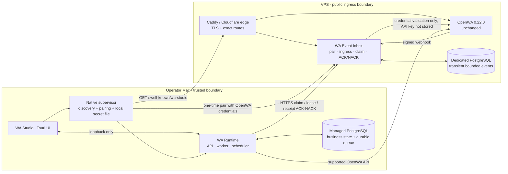
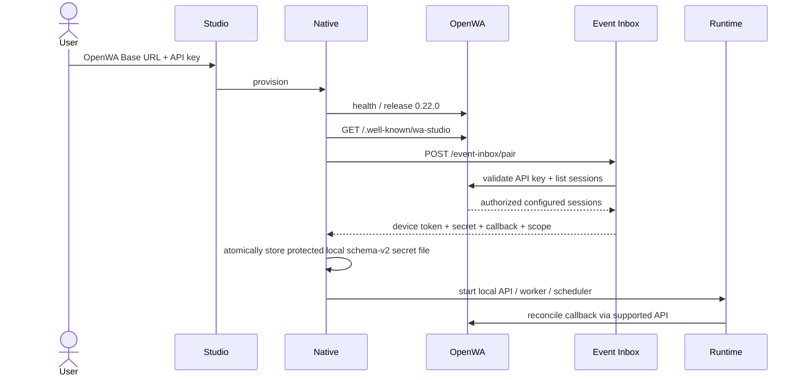
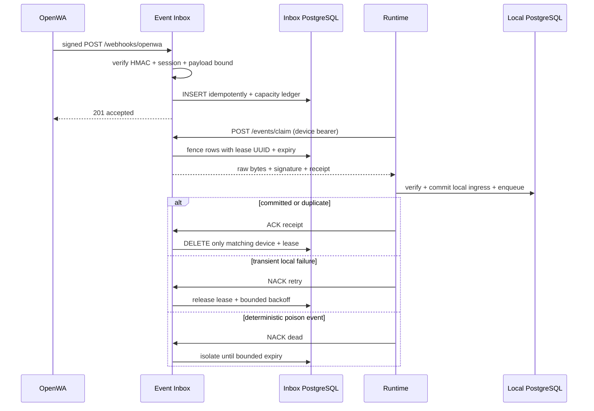

# Post-deployment system model

## Topology

Only Caddy exposes TCP 443. Runtime and managed PostgreSQL bind locally on the Mac. Event Inbox
PostgreSQL has no published port and no shared volume with OpenWA.

## Connect and startup

React never receives the OpenWA key, Runtime key, webhook secret or device token. A v1 local secret
record is treated as absent rather than migrated or used as fallback.

## Durable callback delivery

A crash before ACK leads to redelivery after lease expiry. A stale receipt cannot delete a row that
has been re-leased. Local idempotency collapses duplicates.

## Ownership and bounds

| State | Authority | Bound |
| --- | --- | --- |
| Campaigns, messages, projections, queues | Local Runtime PostgreSQL | Retention and encrypted desktop backups |
| WhatsApp sessions and gateway facts | OpenWA stores | OpenWA lifecycle |
| Uncommitted callback bytes | Event Inbox PostgreSQL | 100,000 events, 256 MiB, seven days |
| Device/OpenWA/Runtime secrets | App data directory | Schema v2; `0700` directory / `0600` file; never returned to React |
| Event Inbox logs | Docker JSON logs | 10 MiB × 3 files per container |

Event Inbox returns HTTP 503 when either event or byte capacity would be exceeded. Readiness exposes
stored, pending, leased, dead, oldest-pending and configured limit metrics.

## Failure behavior

| Failure | Automatic behavior | Operator action |
| --- | --- | --- |
| Mac sleeps or changes network | Event Inbox keeps signed callbacks | Reopen Studio before capacity or retention limits |
| Runtime crashes after local commit | Lease expires; duplicate collapses locally | None unless retries grow |
| Malformed callback | Runtime NACKs dead; later events continue | Inspect dead count without exposing payload |
| Event Inbox restart | PostgreSQL retains committed rows and leases | Consumer resumes |
| OpenWA unavailable during pairing | Pairing fails closed; local secret file is unchanged | Restore OpenWA, retry Connect |
| Master secret rotation | Existing device token/signature become invalid | Reconnect Studio and reconcile webhook |
| VPS disk pressure | hard row/byte/expiry/log/WAL bounds limit growth | Inspect exact owners; never broad-prune volumes |
